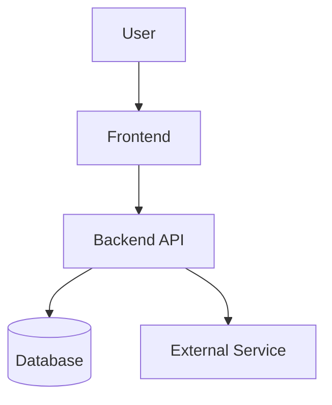
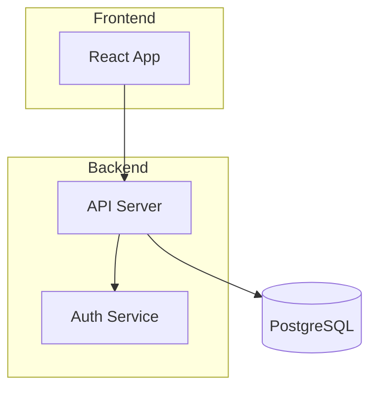
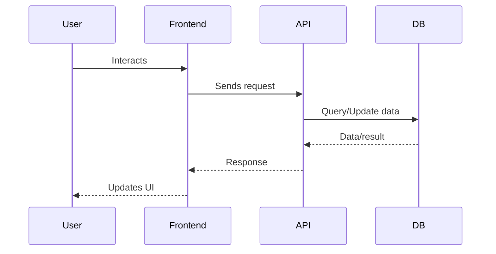

# Markdown Conventions and Best Practices for LLMs

## General Guidelines
- Use clear, concise language and consistent formatting.
- Prefer semantic section headers (e.g., ## Overview, ## Implementation Plan).
- Use bullet points, numbered lists, or tables for clarity.
- Use code blocks for code, configuration, or diagrams (e.g., mermaid, json).
- Prefer diagrams (mermaid) for architecture and flows.
- Keep documentation up to date with code changes and always provide rationale for technology or design choices.
- Use bold or italics for emphasis only when necessary.
- Avoid excessive nesting of lists or sections.

## Reference Policy
- This markdown instruction file is referenced by Copilot and Planner chatmodes for all documentation and planning deliverables. Follow these conventions for all markdown-based outputs.

## Diagram Placement
- Place architecture diagrams immediately after the Overview section, or in a dedicated "Architecture Diagrams" section.
- Use Mermaid for all architecture and flow diagrams.

## Table of Contents
- For markdown files longer than 100 lines, include a Table of Contents after the main title.

## Update Policy
- Update this documentation whenever code or architecture changes impact the described system.

## Response Format (for LLMs/Planners)
- Structure all markdown deliverables using the following order:
  1. Overview
  2. Architecture Diagrams
  3. Design Guidelines
  4. Implementation Plan
  5. Additional Sections as needed

## README.md Template

# Project Architecture

## Overview

Brief description of the project and its goals.

## Architecture Diagrams

### System Context

### Container Diagram

### Key Data & Flow Diagram

## Design Guidelines

- **Functional/Modular Approach:** Organize code by feature or domain, not by class.
- **Separation of Concerns:** Keep UI, business logic, and data access separate.
- **Stateless Functions:** Prefer pure functions and composition.
- **Explicit Data Flow:** Use clear, predictable data flow (e.g., unidirectional for frontend state).

> Refer to the diagrams above for visual guidance on system structure and data flow.

## Implementation Plan

1. Set up project structure
2. Build authentication
3. Implement main features