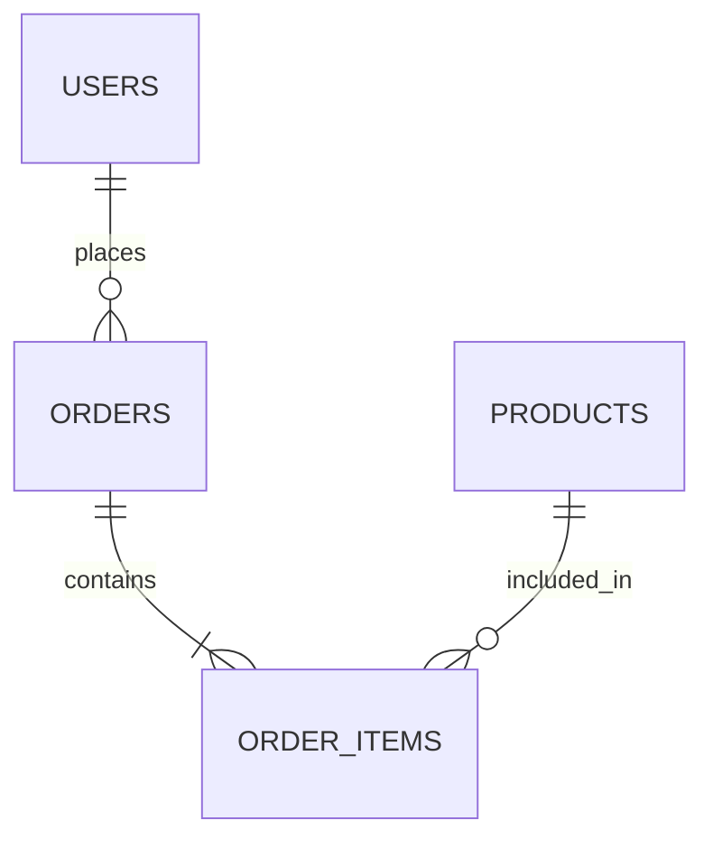

# Database Standards & Best Practices

## Overview

This document outlines best practices for database design, data modeling, and management to ensure maintainability, scalability, and data integrity across projects.

## File & Folder Organization

- All database-related files must be placed in the `api/db/` folder at the backend root.
- Use the following subfolders only as needed:
  - `migrations/` – migration scripts (e.g., Drizzle ORM migrations)
  - `seeds/` – seed data scripts
  - `schema/` – schema definition files (e.g., Drizzle ORM schema, SQL, etc.)
  - `backups/` – database dumps or backup files
- Do not create subfolders unless they are required for your workflow or tooling.
- Example structure:
```text
api/
  db/
    migrations/
    seeds/
    schema/
    backups/
```
- For Drizzle ORM, place schema and migration files in `api/db/schema/` and `api/db/migrations/` respectively, following your project’s organization.

## Data Modeling Best Practices

- **Use Consistent Naming Conventions**
- Use snake_case for table and column names.
- Avoid reserved keywords and ambiguous abbreviations.

- **Normalize Data**
- Apply normalization (up to 3NF) to reduce redundancy.
- Denormalize only for performance reasons, with clear documentation.

- **Define Primary Keys**
- Every table should have a primary key (preferably surrogate keys like UUIDs or auto-increment integers).

- **Use Foreign Keys for Relationships**
- Enforce referential integrity with foreign key constraints.
- Name foreign keys clearly (e.g., user_id).

- **Indexing**
- Index columns used in JOIN, WHERE, and ORDER BY clauses.
- Avoid excessive indexing to prevent write performance degradation.

- **Data Types**
- Use appropriate data types for each column (e.g., INTEGER for counts, TIMESTAMP for dates).
- Avoid using generic types like TEXT for structured data.

- **Nullability**
- Only allow NULL where it makes sense; prefer NOT NULL with defaults where possible.

- **Documentation**
- Document each table and column with comments describing their purpose.
- Use SQL `COMMENT ON` statements or inline comments as appropriate.

## General Database Best Practices

- **Migrations**
- Use migration tools (e.g., Drizzle ORM migrations) to version schema changes.
- Review and test migrations before applying to production.

- **Backups**
- Schedule regular automated backups.
- Test restore procedures periodically.
- Store backup files in `api/db/backups/` if needed.

- **Security**
- Use least-privilege principles for database users.
- Store credentials securely (never in source code).

- **Performance**
- Monitor query performance and optimize slow queries.
- Archive or purge old data as needed.

## Testing & Seed Data

- Place seed and test data scripts in `api/db/seeds/` or a similar folder.
- Use realistic but non-sensitive data for testing.

## Example Entity Relationship Diagram


